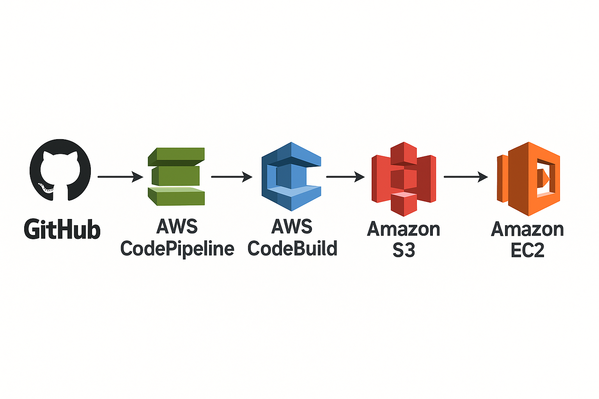

<!-- paginate: skip -->
<!-- _class: lead -->


<!-- Title Slide -->
# WordPress CI/CD 入門
**～ GitHub Actions と AWS CodePipeline で実現する自動デプロイ～**
<br>
<br>
**[岡本 渉](https://www.threads.com/@wokamoto1973)** | Kansai WordPress Meetup@KOBE
2025年8月16日 

---
<!-- paginate: true -->


## 自己紹介

* 好きな言葉
  * Infrastructure as Code
  * 冪等性
* 大体ビールを呑んでいます
  * WordCamp Kansai 2024 ビアスポンサー
* SNS
  * X ([@wokamoto](https://x.com/wokamoto))
  * Threads ([@wokamoto1973](https://www.threads.com/@wokamoto1973))

---


<!-- Agenda -->
## Agenda  
1. CI/CD の基礎  
2. GitHub Actions 概要  
3. GitHub Actions 実践（コード例＋マップ）  
4. AWS CodePipeline 概要  
5. AWS CodePipeline 実践（コード例＋マップ）  
6. 比較＆ベストプラクティス  
7. まとめ＆Q&A  

---


<!-- CI/CD Basics 1 -->
## CI/CD とは？
- **継続的インテグレーション ( Continuous Integration )**  
  - コード変更 → 自動テスト・ビルド  
- **継続的デリバリー ( Continuous Delivery )**  
  - テスト通過 → 自動デプロイ  

---

<!-- CI/CD Basics 2 -->
## 従来のWordPress運用の課題 
### FTPアップロードの実態とリスク
- 開発者PC → FTPクライアントで → サーバーへ
- 上書き順序を間違えると壊れる
- 本番サーバーに直接アクセスする恐怖

---

### よくあるトラブル
- `style.css` や `functions.php` が壊れて真っ白
- 一部ファイルだけアップされず不具合に気づけない
- 差分の管理が手動で非効率

---

### 問題の本質
- バージョン管理がない（Git未使用）
- ステージング環境と本番環境のソースコードが同一である保証が無い
- 作業の履歴が残らない（誰が何をしたかわからない）
- 作業者ごとに手順が異なり属人化

---

<!-- GitHub Actions Overview 1 -->


### GitHub Actionsとは？
- GitHub に標準搭載されている CI/CD 機能
- YAML ファイルで処理を記述し、Push などをトリガーに実行
- サーバーへのデプロイ、Lint、テストなど自由に設定可能

---

## GitHub Actions 概要①  
- ワークフローを YAML で定義  
- GitHub Marketplace の各種アクション  
- デプロイは `rsync` や `scp` を使って設定

---

<!-- GitHub Actions Overview 2 -->
## GitHub Actions 概要②  
- 主なステップ例  
  1. `actions/checkout`  
  2. PHP セットアップ  
  3. Composer／npm インストール  
  4. PHPUnit／ESLint 実行  
  5. デプロイ  

---

<!-- GitHub Actions Overview 3 -->
## GitHub Actions 概要③  
- シークレット管理  
  - SSH_KEY, FTP, API_TOKEN…  
- キャッシュ設定  
  - `actions/cache`  

---

<!-- GH Actions Map -->
## GitHub Actions ワークフローマップ  


---

<!-- GH Actions Deploy Staging -->
## GitHub Actions: staging
`.github/workflows/deploy-staging.yml`
```yaml
name: Deploy to Staging

on:
  push:
    branches: [ development ]
  workflow_dispatch:
jobs:
  test:
    runs-on: ubuntu-latest
    steps:
    - name: Checkout code
      uses: actions/checkout@v4
    - name: PHP Syntax Check
      uses: ./.github/actions/php-syntax-check
```

---

<!-- GH Actions CI -->
## GitHub Actions: php-syntax-check
`.github/actions/php-syntax-check/action.yml`
```yaml
name: PHP Syntax Check
description: Checks PHP syntax for errors.
runs:
  using: "composite"
  steps:
    - name: Setup PHP
      uses: shivammathur/setup-php@v2
      with:
        php-version: '8.2'
    - name: Run PHP Syntax Check
      shell: bash
      run: |
        find . -name "*.php" -print0 | xargs -0 -n1 php -l
```

---

<!-- GH Actions Deploy Production -->
## GitHub Actions: production
内容は `deploy-staging.yml` とほぼ一緒。

- `branches: [ development ]` → `branches: [ main ]`
- `STAGING` → `PRODUCTION`

`.github/workflows/deploy-production.yml`
```yaml
name: Deploy to Production

on:
  push:
    branches: [ main ]
  workflow_dispatch:
  :
```

---

## Secrets
- `SSH_PRIVATE_KEY_STAGING` : (STG環境) SSH接続に使用する鍵
- `STAGING_SERVER_HOST` : (STG環境) SSH接続先のサーバ名
- `STAGING_SERVER_USER` : (STG環境) SSH接続時のユーザ名
- `STAGING_WEB_DOC_ROOT` : (STG環境) ウェブドキュメントルート
- `SSH_PRIVATE_KEY_PRODUCTION` : (本番環境) SSH接続に使用する鍵
- `PRODUCTION_SERVER_HOST` : (本番環境) SSH接続先のサーバ名
- `PRODUCTION_SERVER_USER` : (本番環境) SSH接続時のユーザ名
- `PRODUCTION_WEB_DOC_ROOT` : (本番環境) ウェブドキュメントルート

---

<!-- GH Actions Demo Placeholder -->
## GitHub Actions でのデプロイのデモ 

https://github.com/wokamoto/wp_cicd_sample_gha

---


<!-- AWS Overview 1 -->
## AWS CodePipeline とは？
- AWSが提供する CI/CD 自動化サービス
- GitHub や CodeCommit などをソースに、CodeBuild で処理、CodeDeploy でEC2やS3にデプロイ
- GUI でのフロー設計が可能で、視覚的にわかりやすい
- ステージング／本番で別パイプライン運用推奨  
- 各ステージごとに通知・承認可 

---

<!-- AWS Map -->
## AWS CodePipeline ワークフローマップ  


---

<!-- AWS buildspec -->
## buildspec.yml (共通)
```yaml
version: 0.2
phases:
  build:
    commands:
      - chmod +x scripts/*.sh || true
artifacts:
  files:
    - appspec.yml
    - scripts/**/*
    - dest/**/*
```

---

<!-- AWS appspec -->
## appspec.yml (共通)
```yaml
version: 0.0
os: linux
files:
  - source: dest
    destination: /var/www/html/source
hooks:
  AfterInstall:
    - location: scripts/source_sync.sh
      timeout: 300
      runas: root
```

---

## scripts/source_sync.sh (共通)
```bash
#!/usr/bin/env bash
set -euo pipefail

DEST_DIR="/var/www/html"
RELEASES_DIR="$DEST_DIR/releases"
CURRENT_LINK="$DEST_DIR/current"
SRC_DIR="$DEST_DIR/source"
NGINX_USER="nginx"
NGINX_GROUP="nginx"

EXCLUDES=(
  "--exclude" "wp-content/uploads/"
  "--exclude" "wp-config.php"
)

mkdir -p "$RELEASES_DIR"
TIMESTAMP="$(date '+%Y%m%d%H%M%S')"
RELEASE_DIR="$RELEASES_DIR/$TIMESTAMP"
mkdir -p "$RELEASE_DIR"
 :
```

---

<!-- AWS Demo Placeholder -->
## AWS CodePipeline でのデプロイのデモ 

https://github.com/wokamoto/wp_cicd_sample_codepipeline

---

<!-- Comparison & Best Practices -->
## GitHub ActionsとAWS CodePipelineの比較

| 比較項目             | GitHub Actions                          | AWS CodePipeline                         |
|----------------------|-----------------------------------------|-------------------------------------------|
| 設定のしやすさ       | YAMLで簡単に開始                         | IAM・Secrets 設定が必要                    |
| 可視化               | ログと履歴がテキスト中心                | GUI でステージや失敗原因が見やすい        |
| AWS連携              | 外部からの接続（SSH等）で対応            | IAMロール・CodeDeploy でAWSリソースと統合 |
| 環境の切り替え       | ブランチ名などで柔軟に分岐               | 複数 Pipeline or CodeBuild 条件で制御       |

---

## CI/CD導入による効果

| 項目             | 導入前（手作業）            | 導入後（CI/CD）                   |
|------------------|------------------------------|------------------------------------|
| 作業効率         | 手作業・属人的                | 自動化・手順不要                   |
| 安全性           | 上書き・操作ミスのリスク大    | ブランチ管理・自動処理で安全       |
| 履歴管理         | なし                          | Git ログと CI ログで追跡可能          |
| 確認・承認       | 口頭ベース・曖昧              | ステージング後に本番マージで管理   |

---

## 導入時の注意点とチーム運用

### ✅ 導入前のチェックリスト
- サーバーはSSHで接続可能か
- `.gitignore`で必要ファイルが除外されていないか
- `wp-config.php`や環境設定が分離できているか
- Secrets の共有方法はチーム内で決まっているか

---

### ⚠️ ハマりがちなポイント
- `.gitignore` で必要ファイルが除外されている
- rsync 先のパーミッション設定忘れ
- Secrets に鍵を入れ忘れて失敗
- サーバーの SSH 設定で「接続拒否」される

---

### 🤝 チームでの運用ポイント
- デプロイルールと運用ドキュメントの整備
- Slack などで通知を送る仕組みを追加
- Pull Request → マージ → 自動デプロイの文化を作る

---

<!-- Summary & Q&A -->
## まとめ＆Q&A  
- CI/CD を導入すると「安全・高速・安心」の3拍子が揃う
- 属人性の排除、履歴管理、作業の一貫性が生まれる
- GitHub Actions と AWS CodePipeline の特性把握  
- まずはステージング導入からスタート！  

---

## これから導入したい方へ
- 最初はステージングのみで試験導入からでもOK
- 無料枠でも十分な範囲で構築可能
- 小さな一歩から、安全な WordPress　運用をはじめよう！