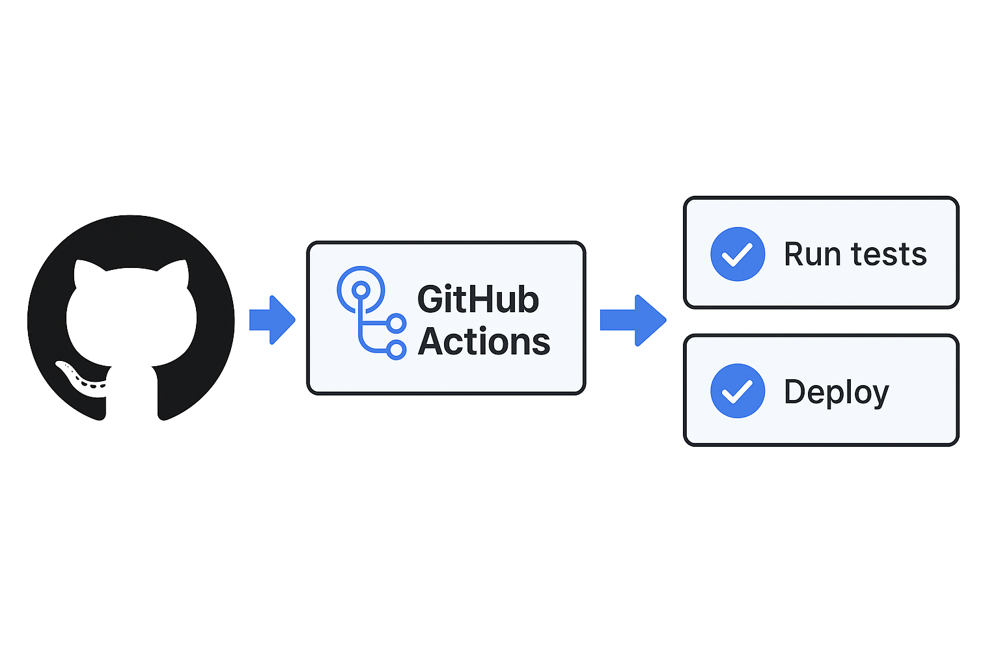

<!-- paginate: skip -->
<!-- _class: lead -->


<!-- Title Slide -->
# WordPress CI/CD入門
**～GitHub ActionsとAWS CodePipelineで実現する自動デプロイ～**
<br>
<br>
**岡本 渉** | Kansai WordPress Meetup@KOBE
2025年8月16日 

---
<!-- paginate: true -->


<!-- Agenda -->
## Agenda  
1. CI/CD の基礎  
2. GitHub Actions 概要  
3. GitHub Actions 実践（コード例＋マップ）  
4. AWS CodePipeline 概要  
5. AWS CodePipeline 実践（コード例＋マップ）  
6. 比較＆ベストプラクティス  
7. まとめ＆Q&A  

---

<!-- CI/CD Basics 1 -->
## CI/CD とは？
- **継続的インテグレーション ( Continuous Integration )**  
  - コード変更 → 自動テスト・ビルド  
- **継続的デリバリー ( Continuous Delivery )**  
  - テスト通過 → 自動デプロイ  

---

<!-- CI/CD Basics 2 -->
## 従来のWordPress運用の課題 
### FTPアップロードの実態とリスク
- 開発者PC → FTPクライアントで → サーバーへ
- 上書き順序を間違えると壊れる
- 本番サーバーに直接アクセスする恐怖

---

### よくあるトラブル
- `style.css`や`functions.php`が壊れて真っ白
- 一部ファイルだけアップされず不具合に気づけない
- 差分の管理が手動で非効率

---

### 問題の本質
- バージョン管理がない（Git未使用）
- 作業の履歴が残らない（誰が何をしたかわからない）
- 作業者ごとに手順が異なり属人化

---

<!-- GitHub Actions Overview 1 -->


### GitHub Actionsとは？
- GitHubに標準搭載されているCI/CD機能
- YAMLファイルで処理を記述し、Pushなどをトリガーに実行
- サーバーへのデプロイ、Lint、テストなど自由に設定可能

---

## GitHub Actions 概要①  
- ワークフローを YAML で定義  
- GitHub Marketplace の各種アクション  
- デプロイは `rsync` や `scp` を使って設定

---

<!-- GitHub Actions Overview 2 -->
## GitHub Actions 概要②  
- 主なステップ例  
  1. `actions/checkout`  
  2. PHP セットアップ  
  3. Composer／npm インストール  
  4. PHPUnit／ESLint 実行  
  5. デプロイ  

---

<!-- GitHub Actions Overview 3 -->
## GitHub Actions 概要③  
- シークレット管理  
  - SSH_KEY, FTP, API_TOKEN…  
- キャッシュ設定  
  - `actions/cache`  

---

<!-- GH Actions Map -->
## GitHub Actions ワークフローマップ  


---

<!-- GH Actions Deploy Staging -->
## GitHub Actions: staging
`.github/workflows/deploy-staging.yml`
```yaml
name: Deploy to Staging

on:
  push:
    branches: [ development ]
  workflow_dispatch:
jobs:
  test:
    runs-on: ubuntu-latest
    steps:
    - name: Checkout code
      uses: actions/checkout@v4
    - name: PHP Syntax Check
      uses: ./.github/actions/php-syntax-check
```
<!--
  deploy:
    needs: test
    runs-on: ubuntu-latest
    steps:
    - name: Checkout code
      uses: actions/checkout@v4
    - name: Set up SSH
      uses: webfactory/ssh-agent@v0.9.0
      with:
        ssh-private-key: ${{ secrets.SSH_PRIVATE_KEY_STAGING }}
    - name: Rsync files to Staging
      run: |
        SSH_HOST="${{ secrets.STAGING_SERVER_HOST }}"
        SSH_USER="${{ secrets.STAGING_SERVER_USER }}"
        WEB_DOC_ROOT="${{ secrets.STAGING_WEB_DOC_ROOT }}/"
        rsync -avzc --delete --exclude='.*' \
         --exclude wp-config.php \
         --exclude wp-content/uploads/ \
         -e "ssh -o StrictHostKeyChecking=no" \
         ./ "${SSH_USER}"@"${SSH_HOST}":"${WEB_DOC_ROOT}"
-->

---

<!-- GH Actions CI -->
## GitHub Actions: php-syntax-check
`.github/actions/php-syntax-check/action.yml`
```yaml
name: PHP Syntax Check
description: Checks PHP syntax for errors.
runs:
  using: "composite"
  steps:
    - name: Setup PHP
      uses: shivammathur/setup-php@v2
      with:
        php-version: '8.2'
    - name: Run PHP Syntax Check
      shell: bash
      run: |
        find . -name "*.php" -print0 | xargs -0 -n1 php -l
```

---

<!-- GH Actions Deploy Production -->
## GitHub Actions: production
内容は `deploy-staging.yml` とほぼ一緒。

- `branches: [ development ]` → `branches: [ main ]`
- `STAGING` → `PRODUCTION`

`.github/workflows/deploy-production.yml`
```yaml
name: Deploy to Production

on:
  push:
    branches: [ main ]
  workflow_dispatch:
  :
```

---

## Secrets
- `SSH_PRIVATE_KEY_STAGING` : SSH接続に使用する鍵
- `STAGING_SERVER_HOST` : SSH接続先のサーバ名
- `STAGING_SERVER_USER` : SSH接続時のユーザ名
- `STAGING_WEB_DOC_ROOT` : ウェブドキュメントルートのパス ( `/var/www/html` など )

---

<!-- GH Actions Demo Placeholder -->
## GitHub Actions でのデプロイのデモ 

---


<!-- AWS Overview 1 -->
## AWS CodePipeline とは？
- AWSが提供するCI/CD自動化サービス
- GitHubやCodeCommitなどをソースに、CodeBuildで処理、CodeDeployでEC2やS3にデプロイ
- GUIでのフロー設計が可能で、視覚的にわかりやすい
- ステージング／本番で別パイプライン運用推奨  
- 各ステージごとに通知・承認可 

---

<!-- AWS Map -->
## AWS CodePipeline ワークフローマップ  


---

<!-- AWS buildspec -->
## buildspec.yml (共通)
```yaml
version: 0.2

phases:
  build:
    commands:
      - echo Running tests...
      - find . -name "*.php" -print0 | xargs -0 -n1 php -l
  post_build:
    commands:
      - echo Packaging artifacts...
      - zip -r artifact.zip .

artifacts:
  files:
    - artifact.zip
```

---

<!-- AWS appspec -->
## appspec.yml (共通)
```yaml
version: 0.0
os: linux
files:
  - source: artifact.zip
    destination: /var/www/html.source
hooks:
  AfterInstall:
    - location: scripts/source_sync.sh
      timeout: 300
      runas: root
```

---

## scripts/source_sync.sh (共通)
```bash
#!/bin/bash
set -eo pipefail

# Directory where WordPress is deployed
DEPLOY_DIR="/var/www/html"
ARTIFACT="$DEPLOY_DIR.source/artifact.zip"

# source sync
echo "Starting source sync..."
rsync -avzc --delete --exclude='.*' \
  --exclude artifact.zip \
  --exclude wp-config.php \
  --exclude wp-content/uploads/ \
  "$DEPLOY_DIR.source/" "$DEPLOY_DIR"

echo "Starting post-deploy cleanup..."

# Remove the deployment artifact if it exists
if [ -d "$DEPLOY_DIR.source" ]; then
  rm -rf "$DEPLOY_DIR.source"
  echo "Removed artifact"
fi

# Reset ownership and permissions
echo "Setting correct ownership and permissions..."
chown -R apache:www "$DEPLOY_DIR"
find "$DEPLOY_DIR" -type d -exec chmod 755 {} \;
find "$DEPLOY_DIR" -type f -exec chmod 644 {} \;

echo "Cleanup completed successfully."
```

---

<!-- AWS Demo Placeholder -->
## AWS CodePipeline でのデプロイのデモ 

---

<!-- Comparison & Best Practices -->
## GitHub ActionsとAWS CodePipelineの比較

| 比較項目             | GitHub Actions                          | AWS CodePipeline                         |
|----------------------|-----------------------------------------|-------------------------------------------|
| 設定のしやすさ       | YAMLで簡単に開始                         | IAM・Secrets設定が必要                    |
| 可視化               | ログと履歴がテキスト中心                | GUIでステージや失敗原因が見やすい        |
| AWS連携              | 外部からの接続（SSH等）で対応            | IAMロール・CodeDeployでAWSリソースと統合 |
| 環境の切り替え       | ブランチ名などで柔軟に分岐               | 複数Pipeline or CodeBuild条件で制御       |

---

## CI/CD導入による効果

| 項目             | 導入前（手作業）            | 導入後（CI/CD）                   |
|------------------|------------------------------|------------------------------------|
| 作業効率         | 手作業・属人的                | 自動化・手順不要                   |
| 安全性           | 上書き・操作ミスのリスク大    | ブランチ管理・自動処理で安全       |
| 履歴管理         | なし                          | GitログとCIログで追跡可能          |
| 確認・承認       | 口頭ベース・曖昧              | ステージング後に本番マージで管理   |

---

## 導入時の注意点とチーム運用

### ✅ 導入前のチェックリスト
- サーバーはSSHで接続可能か
- `.gitignore`で必要ファイルが除外されていないか
- `wp-config.php`や環境設定が分離できているか
- Secretsの共有方法はチーム内で決まっているか

---

### ⚠️ ハマりがちなポイント
- `.gitignore`で必要ファイルが除外されている
- rsync先のパーミッション設定忘れ
- Secretsに鍵を入れ忘れて失敗
- サーバーのSSH設定で「接続拒否」される

---

### 🤝 チームでの運用ポイント
- デプロイルールと運用ドキュメントの整備
- Slackなどで通知を送る仕組みを追加
- Pull Request → マージ → 自動デプロイの文化を作る

---

<!-- Summary & Q&A -->
## まとめ＆Q&A  
- CI/CDを導入すると「安全・高速・安心」の3拍子が揃う
- 属人性の排除、履歴管理、作業の一貫性が生まれる
- GitHub Actions と AWS CodePipeline の特性把握  
- まずはステージング導入からスタート！  

---

## これから導入したい方へ
- 最初はステージングのみで試験導入からでもOK
- 無料枠でも十分な範囲で構築可能
- 小さな一歩から、安全なWordPress運用をはじめよう！